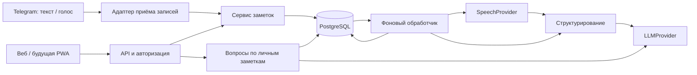

# План бэкенда умных заметок

Дата: 29 сентября 2026 года. Первый демонстрационный сценарий нужен к субботе, 3 октября 2026 года. Документ описывает проектируемое поведение; код ещё не реализован.

## Основания и ограничения

Из запроса команды: веб/PWA как основное приложение; ИИ отвечает на запросы и помогает структурировать заметки; ввод текстом и голосом; Telegram принимает записи; история разработки хранится в GitHub `Vafailer/Disrupt`.

Из локального мемо встречи с наставником: первая неделя разработки, следующая — доработка и пользователи; сначала бэкенд; целевую аудиторию ещё предстоит уточнить, рассматриваются студенты и создатели контента. Название файла содержит 26.10.26, но в тексте указана встреча 26.09: дату нельзя считать однозначно установленной по имени файла.

В предоставленном положении, п. 4.2, упомянуты работающий MVP, не менее 20 интервью, не менее 50 реальных пользователей и аналитика. В п. 1.8 конец первого этапа указан как 14.10.2026, а в расшифровке онбординга звучит 15 октября. Это сведения из предоставленных материалов, не проверка актуального расписания организаторов. Внутренний срок демо — 3 октября — задаёт текущий план.

Расшифровка онбординга содержит ошибки. В техническом обсуждении примерно 40:23–43:07 упоминается Cloud.ru Foundation Models. Итоговый автоматический конспект делает более жёсткие выводы об ограничениях моделей, чем основная расшифровка; не принимать его за подтверждение обязательного провайдера.

## Что должно получиться к демо

Основной сценарий: войти → отправить текст → открыть сохранённую структурированную заметку → найти её → задать вопрос по своим заметкам → увидеть ответ с источниками.

Голос и Telegram реализуются после текстового сценария. Telegram принимает текст и голосовые сообщения и возвращает статус/ссылку; полноценный редактор находится в вебе. Не запускать интеграционного бота без конфигурации владельца. Подключение настоящей модели владельцем отделено от полностью автономных тестов с mock.

До субботы не закладывать полный аналог Obsidian: граф знаний, плагины, совместное редактирование, полноценную офлайн-синхронизацию и автономного агента общего назначения. Минимальная веб-страница нужна для пользовательского демо; Swagger достаточен для проверки API разработчиками, но не заменяет пользовательский интерфейс. Установка PWA и офлайн-редактор — отдельный этап фронтенда.

## Архитектура

Один модульный бэкенд с едиными правилами для веба и Telegram. API принимает запросы, PostgreSQL хранит заметки и задания, фоновый обработчик выполняет длительные операции. ИИ и распознавание подключаются через независимые интерфейсы.

Предлагаемый стек: Python + FastAPI для API, PostgreSQL для данных и начального поиска, SQLAlchemy + Alembic для доступа к БД и миграций, pytest для тестов, Docker Compose для воспроизводимого запуска. FastAPI предоставляет OpenAPI и интерактивную документацию [по официальной документации](https://fastapi.tiangolo.com/features/). Для первой версии достаточно [полнотекстового поиска PostgreSQL](https://www.postgresql.org/docs/current/textsearch.html); качество русского поиска проверять на примерах команды. Семантический поиск отложить, чтобы не расходовать запросы на embeddings и не усложнять первый выпуск.

Задания сначала хранить в PostgreSQL. Отдельный процесс того же приложения забирает их с блокировкой, сроком аренды и ограничением попыток. Не полагаться на задачу в памяти процесса API: перезапуск не должен терять принятую запись. Redis и специализированную очередь добавлять по фактической необходимости.

## Как ИИ взаимодействует с заметками

1. Авторизованный ввод сохраняется как исходная запись с владельцем и источником. Повтор того же запроса с тем же ключом идемпотентности не создаёт дубль; другой payload с тем же ключом отклоняется.
2. Для голоса создаётся задание распознавания. Полученный текст сохраняется отдельно от исходного аудио; ошибка оставляет запись доступной для повторной обработки.
3. Структурирование возвращает ограниченную схему: заголовок, Markdown-содержимое, краткое резюме, теги. Бэкенд проверяет типы, длины и допустимые поля. Ошибочный ответ модели не заменяет исходник и не запускает бесконечные повторные запросы.
4. Для вопроса поиск выполняется только среди заметок текущего пользователя. В модель передаются найденные фрагменты в пределах лимита, вопрос и правила ответа. Текст заметки считается данными, а не инструкцией приложению.
5. Ответ содержит идентификаторы источников. Сервер проверяет, что ссылки относятся к реально переданным фрагментам; это проверяет ссылки, но не доказывает правдивость текста. При отсутствии достаточного контекста интерфейс показывает, что ответ не найден в заметках.
6. Для изменения уже существующей заметки ИИ создаёт предложение. Пользователь видит изменения и подтверждает применение; сервер проверяет владельца и версию заметки, сохраняет новую ревизию. Удаление и массовые изменения не включать в первую версию ИИ.

Модель не получает прямой доступ к БД. Даже если позже добавляется function calling, доступны только явно разрешённые функции приложения с проверкой прав и аргументов. В первом выпуске достаточно фиксированных операций структурирования и ответа по контексту.

## Данные

| Сущность | Назначение |
| --- | --- |
| User / Session | Пользователь и серверная сессия; пароли хешируются, сессии имеют срок действия |
| Capture | Неизменённый исходный текст или ссылка на аудио, источник, владелец, ключ идемпотентности |
| Note / NoteRevision | Заголовок, Markdown, теги, владелец, версия и история |
| ProcessingJob | Тип обработки, статус, число попыток, срок аренды, код ошибки |
| Chat / Message | Вопрос, ответ, источники и владелец диалога |
| ChangeProposal | Предложение ИИ и версия заметки, к которой оно относится |
| TelegramLink | Привязка Telegram ID к аккаунту приложения |
| UsageEvent | Операция, режим mock/live, длительность, статус, расход, если провайдер его сообщает |

Все запросы к пользовательским данным фильтруются по владельцу, включая аудио, задания, версии и поиск. Веб-сессии — HttpOnly cookie, Secure в production; изменяющие запросы защищены от CSRF. Для пилота можно ограничить регистрацию приглашениями.

Telegram связывается с аккаунтом одноразовым кодом с коротким сроком действия, созданным после входа в веб. Не доверять присланному `user_id`. Проверять источник webhook, принимать личные сообщения и дедуплицировать `update_id`. Аудио сохранять в закрытом хранилище с лимитом размера/длительности; формат проверять на сервере, доступ давать только владельцу. Срок хранения аудио определить до пользовательского запуска.

## Предварительный контракт API

Все пути, кроме health и входа, требуют авторизации. Это проект контракта, а не существующие endpoints.

| Метод и путь | Результат |
| --- | --- |
| `GET /health` | Состояние приложения без обращения к моделям |
| `POST /api/v1/auth/register`, `/login`, `/logout` | Регистрация, вход, выход |
| `POST /api/v1/captures/text` | Сохранение текста и `202` с ID задания |
| `POST /api/v1/captures/audio` | Приём файла и `202` с ID задания |
| `GET /api/v1/jobs/{id}` | Статус: queued / running / succeeded / failed |
| `GET /api/v1/notes?query=...` | Список или поиск личных заметок с пагинацией |
| `GET /api/v1/notes/{id}` | Заметка с версией |
| `PATCH /api/v1/notes/{id}` | Ручная правка с проверкой версии; конфликт — `409` |
| `POST /api/v1/chat/messages` | Вопрос по выбранным или найденным заметкам |
| `POST /api/v1/notes/{id}/proposals` | Предложение изменения от ИИ |
| `POST /api/v1/proposals/{id}/apply` | Подтверждение с проверкой версии |
| `POST /api/v1/telegram/link-code` | Одноразовый код привязки |
| `POST /api/v1/telegram/webhook` | Приём Telegram update с проверкой секрета webhook |

## Провайдеры и запрет расходовать токен

Cloud.ru Foundation Models — кандидат по онбордингу, а не установленный по токену факт. [Публичный справочник](https://cloud.ru/docs/foundation-models/ug/topics/api-ref) описывает endpoint `https://foundation-models.api.cloud.ru/v1/`; [быстрый старт](https://cloud.ru/docs/foundation-models/ug/topics/quickstart) показывает запросы Chat Completions. Это позволяет спроектировать заменяемый HTTP-адаптер, но не подтверждает права выданного ключа или поддержку каждой модели.

В [публичном каталоге](https://cloud.ru/docs/foundation-models/ug/topics/overview__available__models) перечислены текстовые и Audio-to-Text модели. Выбор конкретных ID сделать по документации доступа команды, совместимости, русскому языку и доступному бюджету. Не предполагать, что один ключ автоматически даёт доступ к распознаванию речи.

- `LLMProvider`: структурирование и ответ по контексту; `SpeechProvider`: распознавание аудио.
- В разработке выбирать только `MockLLMProvider` и `MockSpeechProvider`. Имитация распознавания явно помечается в интерфейсе и не считается настоящим распознаванием.
- Реальный ключ не нужен для реализации адаптера: схемы, тайм-ауты, 401/429/5xx и ошибочные ответы проверяются подменённым HTTP-транспортом.
- Режим mock не читает реальный ключ, не создаёт внешнего клиента и не имеет автоматического fallback. Тесты блокируют сетевые вызовы к провайдерам; CI не получает секреты.
- Агент не выполняет ни одного запроса с выданным токеном, включая список моделей и проверку баланса. Настоящий пользовательский режим настраивает владелец окружения.
- Для live-окружения предусмотреть лимиты запросов на пользователя, длины входа и ответа, общий бюджет и запрет скрытых повторов. Неоднозначный тайм-аут может означать выполненный и оплаченный запрос; такой вызов не повторять автоматически.
- Секреты находятся только на сервере. В логи не помещать токены и содержимое заметок. События mock и live разделять; тестовые действия не считать реальными пользователями и расходами.

## План до субботы

План предполагает узкий MVP; доступность хостинга и реального провайдера пока не подтверждена.

| Дата | Этап | Проверяемый результат |
| --- | --- | --- |
| Вт, 29 сентября | Архитектура, каркас API, БД, mock, начало сессий и изоляции | Приложение запускается без ключа; API описан; данные сохраняются |
| Ср, 30 сентября | Приём текста, задания, заметки, поиск | Сквозной текстовый сценарий; перезапуск не теряет запись; повтор не создаёт дубль |
| Чт, 1 октября | Вопросы по заметкам, источники, адаптеры ИИ и речи | Контрактные тесты без сети; сохранение исходника при сбое; изоляция контекста |
| Пт, 2 октября | Аудиоввод, Telegram, минимальная веб-страница, подготовка развёртывания | Привязка аккаунтов и приём сообщений проверены фикстурами; интерфейс показывает статусы |
| Сб, 3 октября | Исправления и демонстрация | Команда проходит сценарий; перечислены подтверждённые функции и ограничения live-интеграций |

Порядок при нехватке времени: текст и сохранность → поиск и ответы → голос → Telegram → предложения правок ИИ. Голос/Telegram не должны задержать текстовое демо. Для демонстрации настоящего ИИ требуется, чтобы команда сама настроила и проверила пользовательское окружение; агент не снимает запрет на использование ключа из-за срока.

## Проверки и критерии готовности

- Без настоящих ключей можно поднять приложение, войти, создать текстовую запись, дождаться mock-обработки и найти заметку после перезапуска.
- Второй пользователь не может получить чужую заметку, исходник, аудио, задание, предложение или контекст чата по известному ID.
- Дубли запросов и Telegram updates не создают повторных заметок. Ошибка провайдера сохраняет исходник и даёт понятный статус.
- Некорректный структурированный ответ не повреждает заметку; применение устаревшего предложения возвращает конфликт.
- Вопросы получают ссылки только на доступные пользователю источники; проверяются пустой поиск и инструкции внутри заметок.
- Mock и CI не обращаются к модельным сервисам, даже при случайном наличии ключа в окружении. Ошибки и тайм-ауты проверяются имитацией.
- Для аудио проверяются ограничения и неправильные форматы. Качество настоящего распознавания не объявляется проверенным по mock-тестам.
- README содержит реальные команды запуска, миграций и тестов после появления кода. Версии зависимостей фиксируются; CI выполняет проверки без секретов.
- Аналитика фиксирует завершение сценария, открытие заметки, возврат пользователя, ошибки и время обработки; тексты заметок в события не попадают.

## GitHub и ближайший шаг

Первый коммит фиксирует этот план и правила. Далее — небольшие коммиты по завершённым изменениям: каркас, сессии, текстовые записи, задания, чат, речь, Telegram, интерфейс. Для кода использовать отдельные ветки и PR; не коммитить ключи, пользовательские данные или исходные материалы конкурса.

Ближайшая реализация: каркас FastAPI и PostgreSQL, mock-провайдер, сессии, сохранение текста, обработка и чтение заметки. Провайдера можно уточнять параллельно; это не блокирует работу.

От команды нужны только сведения без секретов: сообщение или документация о выдаче доступа (с удалённым ключом), доступный хостинг и первая аудитория для примеров. Временно использовать короткие русскоязычные учебные/рабочие записи как тестовые сценарии, не заявляя выбранную аудиторию подтверждённой.
