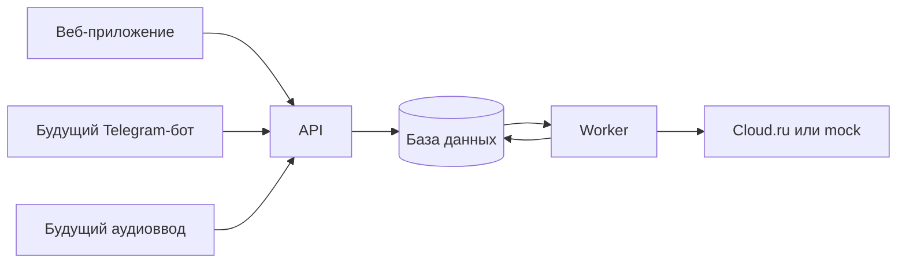

# Бэкенд умных заметок

Наш главный сценарий простой. Человек записывает мысль свободным текстом, получает аккуратную заметку и сам решает, что делать с предложенными выводами. Приложение должно сохранять исходник, даже если модель ошиблась или обработка прервалась.

Первый рабочий вариант принимает текст через веб. В нём уже есть аккаунты, очередь заданий, Markdown-заметка, отдельные выводы, ручные правки и история версий. Telegram, аудиозагрузка, поиск, напоминания и API статистики уже подключены.
Работающий текст и mock проверяются без сетевых обращений к модели.
Реальное STT, экран админки коллеги, PWA и общая приёмка остаются следующими задачами.
Текущие правила статистики есть в [инструкции API](admin-api-v1.md). Текущие команды запуска находятся в [README](../README.md).

## Что должен делать ИИ

ИИ помогает с заголовками, абзацами и списками. Чек-лист нужен только там, где пользователь действительно говорит о действиях. Модель не должна выдавать сомнение за факт или придумывать решение за человека. Возможные выводы показываются отдельно. У каждого вывода есть фрагмент исходного текста, на котором он основан; пустой список выводов допустим.

Например, пользователь пишет «Хочу запустить канал, времени мало, думаю писать по выходным, с темой пока не решил». Заметка может выделить цель, ограничение, идею и открытый вопрос. Возможный вывод звучит так: «План публикаций пока предварительный, потому что тема не выбрана». Выдуманный срок запуска здесь не нужен.

Проверка опорного фрагмента в коде защищает от ответа в неверном формате, но не доказывает, что вывод полезен или верен. Качество команда должна смотреть на собственных примерах при проверке настоящей модели.

## Как проходит запись

1. API проверяет сессию и сохраняет исходный текст вместе с владельцем и ключом идемпотентности. Повтор того же запроса с прежним ключом возвращает существующее задание. Другой текст с этим ключом отклоняется.
2. Worker берёт задание из базы. Очередь переживает перезапуск API. Worker получает только необходимые данные и отправляет один запрос к выбранному провайдеру.
3. Ответ модели проходит проверку схемы, длины полей и опорных фрагментов. При ошибке исходник остаётся доступен, а задание получает статус `failed`. Скрытых платных повторов нет.
4. Результат сохраняется как заметка с номером версии. Выводы имеют статус `proposed`. Пользователь может принять или отклонить их, изменить заголовок и Markdown. Каждая правка сохраняет новую ревизию. Устаревшая версия даёт конфликт `409`.

Исходный текст считается данными, а не командой для приложения. Модель не получает прямого доступа к БД, файловой системе или произвольным запросам. Если позже появятся действия ИИ, каждое из них должно проходить через отдельную функцию бэкенда с проверкой прав и аргументов. Повторная обработка не должна молча заменять ручные правки.

## Устройство сервера

API и worker находятся в одном Python-проекте, но на сервере запускаются отдельными процессами. FastAPI принимает запросы, SQLAlchemy работает с базой, Alembic ведёт миграции. Локально можно использовать SQLite; серверная конфигурация рассчитана на PostgreSQL. Задания лежат в базе, поэтому отдельный брокер для текущего объёма работы не нужен.

Серверная сессия живёт в HttpOnly cookie. В production cookie должна быть Secure, а запросы на изменение данных защищены CSRF-токеном. Каждый запрос к заметкам, заданиям и истории проверяет владельца. API-ключ модели остаётся на сервере; при разделённом запуске его получает только worker. Подробная схема есть в [инструкции по развёртыванию](deployment.md).

Для живой модели действуют общий лимит запросов и лимит на пользователя. Слот резервируется до обращения к Cloud.ru, потому что при тайм-ауте нельзя надёжно понять, был ли запрос обработан. Число слотов не равно денежному бюджету и не измеряет токены.

## Что есть в API

| Запрос | Результат |
| --- | --- |
| `POST /api/v1/auth/register`, `/login`, `/logout` | Аккаунт и сессия |
| `GET /api/v1/auth/me` | Текущий аккаунт и CSRF-токен |
| `POST /api/v1/captures/text` | Сохранение текста и ID задания |
| `GET /api/v1/jobs`, `/api/v1/jobs/{id}` | Список заданий и их состояние |
| `GET /api/v1/notes`, `/api/v1/notes/{id}` | Личные заметки и оригинал |
| `PATCH /api/v1/notes/{id}` | Ручная правка с проверкой версии |
| `PATCH /api/v1/notes/{id}/conclusions/{conclusion_id}` | Принятие или отклонение вывода |
| `GET /api/v1/notes/{id}/revisions` | История изменений |
| `GET /health` | Состояние сервера без обращения к модели |

Аудио- и Telegram-маршрутов пока нет. Их стоит добавлять через тот же сервис записи, чтобы веб и бот не обрабатывали заметки по-разному.

## Голос и Telegram

Голосовое сообщение сначала проходит распознавание, затем обычное структурирование текста. Расшифровку нужно хранить отдельно от аудио и оригинальной записи. Доступ к файлам ограничивается владельцем, а размер, длительность и формат проверяются на сервере. Качество распознавания нельзя подтвердить тестами с подменённым ответом.

Telegram-бот нужен только для отправки текста и голосовых сообщений. Просмотр и редактирование остаются в вебе. Привязку к аккаунту можно сделать через короткоживущий код, созданный после входа в приложение. Бот должен принимать личные сообщения, проверять источник webhook и не создавать дубли при повторном `update_id`. До запуска нужно решить, сколько хранить аудио и где оно будет лежать.

## Как проверять готовность

Без настоящего ключа команда должна суметь запустить приложение, создать запись, увидеть её после перезапуска и пройти редактирование с историей. Второй аккаунт не должен видеть чужие данные. Ошибки провайдера, повтор запроса, конфликт версий и перезапуск worker проверяются автоматическими тестами. Оценку пользы разметки и выводов команда проводит отдельно на 5–10 реальных примерах, когда владелец включит Cloud.ru.

В первом демо не нужен полный аналог Obsidian с графом знаний, плагинами, совместным редактированием и офлайн-синхронизацией. Следующий практический шаг после текстового сценария состоит в проверке настоящей модели владельцем ключа, затем в добавлении аудио и Telegram. Доступ к реальной модели агентам по-прежнему запрещён; детали описаны в [AGENTS.md](../AGENTS.md).
